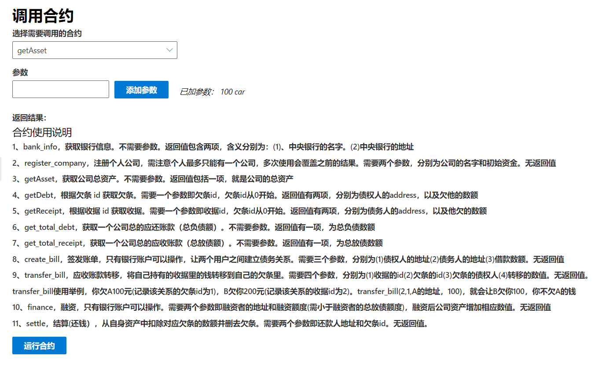
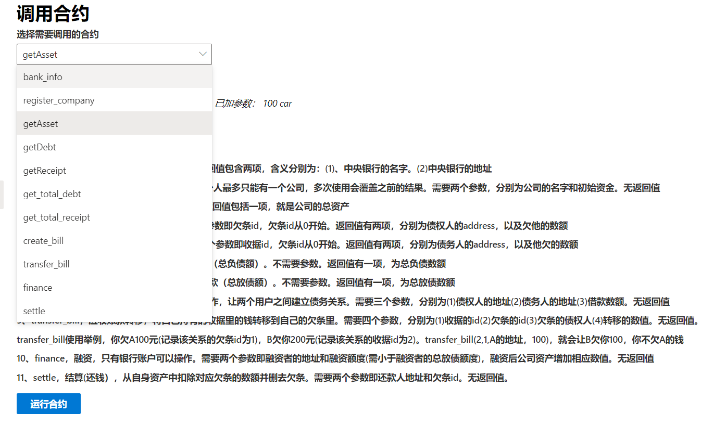

## 关于演示视频
由于本项目内容较多，即便精简到只演示核心操作也不足以压缩到2分钟以内，所以采用了2倍速的剪辑方法
## 关于最后的资产为452
创建公司时为500，后来还了一笔98的欠条，又融资50元，结果为500-98+50=452，正确。
## 关于“直接调用合约”部分
这个部分就是不封装合约，直接使用，功能都包含在其他部分了(其他部分其实就是封装了合约)。所以碍于时长没有演示。  
该页面还包含所有合约的使用说明。细节如下：  
  
  
